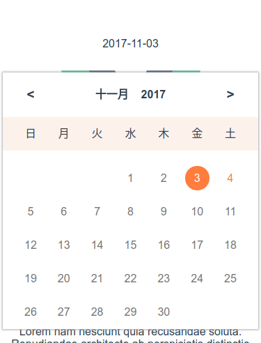
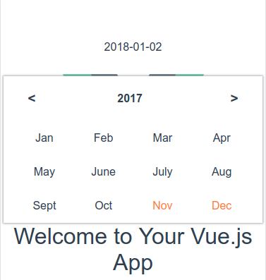
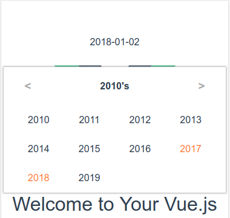

# vue-datepicker-m




## Manual
### props
- highlighted
- disabled
- date
- lang, support 'en' - english, 'cn' - chinese, 'jp' - japanese

**attentions**:
- date format in highlighted and disabled must be as 'yyyy-MM-dd', for example, '2018-01-01'
- date must be as 'yyyy-MM-dd'

### events
- change: pass Date object as params
- close

```html
<date-picker
  lang='en'
  date='2018-01-01'
  :showView='showView'
  :disabled='disabled'
  :highlighted
  @close='close'
  @change='changeDate'>
</date-picker>
```

```javascript
import DatePicker from 'vue-datepicker-m'
components: {
  DatePicker
},
data () {
  return {
    showView: true,
    disabled: {
      from: '2018-03-03',
      to: '1990-01-01'
    },
    highlighted: {
      from: '2017-10-10',
      to: '2017-10-25',
      date: ['2017-12-11', '2017-12-14', '2017-12-19']
    }
  }
}
methods: {
  close () {
    this.showView = false
  },
  changeDate (d) {
    // d is a Date object
  }
}
```

> A Vue.js project

## Build Setup

``` bash
# install dependencies
npm install

# serve with hot reload at localhost:8080
npm run dev

# build for production with minification
npm run build
```

For detailed explanation on how things work, consult the [docs for vue-loader](http://vuejs.github.io/vue-loader).
